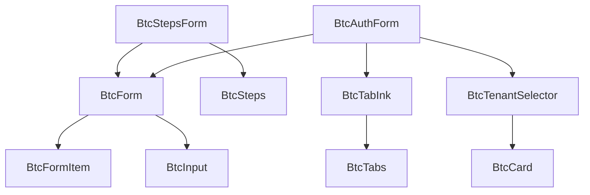

# BTC 组件清单

## 📊 组件总览

### 📈 统计信息

| 分类 | 数量 | 状态 | 迁移优先级 |
|------|------|------|------------|
| 项目级组件库 | 1 | ✅ 已完成 | - |
| 基础模块组件 | 6 | 🔄 待迁移 | 高 |
| 认证页面组件 | 20+ | 🔄 待评估 | 中 |
| **总计** | **27+** | - | - |

## 🏗️ 组件分类详情

### 1. 项目级组件库 (`src/components/`)

| 组件名 | 类型 | 复杂度 | 复用性 | 状态 | 文档 |
|--------|------|--------|--------|------|------|
| `BtcTabInk` | composite | 中等 | 高 | ✅ 完成 | ✅ 完整 |

### 2. 基础模块组件 (`src/modules/base/components/`)

| 组件名 | 类型 | 复杂度 | 复用性 | 迁移建议 | 优先级 |
|--------|------|--------|--------|----------|--------|
| `btc-form` | base | 高 | 极高 | ✅ 迁移到项目级 | 🔥 高 |
| `btc-form-item` | base | 中 | 高 | ✅ 迁移到项目级 | 🔥 高 |
| `btc-steps` | composite | 中 | 高 | ✅ 迁移到项目级 | 🔥 高 |
| `btc-steps-form` | composite | 高 | 高 | ✅ 迁移到项目级 | 🔥 高 |
| `avatar` | base | 低 | 中 | ⚠️ 评估后迁移 | 🔶 中 |
| `icon/svg` | base | 低 | 高 | ⚠️ 评估后迁移 | 🔶 中 |

### 3. 认证页面组件 (`src/modules/base/pages/auth/`)

#### 3.1 登录组件
| 组件名 | 类型 | 复杂度 | 复用性 | 迁移建议 | 优先级 |
|--------|------|--------|--------|----------|--------|
| `password-form` | business | 高 | 中 | ⚠️ 评估后迁移 | 🔶 中 |
| `sms-form` | business | 中 | 低 | ❌ 保持原位 | 🔵 低 |
| `qr-form` | business | 中 | 低 | ❌ 保持原位 | 🔵 低 |
| `tabs` | composite | 中 | 高 | ✅ 迁移到项目级 | 🔶 中 |
| `header` | composite | 低 | 中 | ⚠️ 评估后迁移 | 🔵 低 |
| `footer` | composite | 低 | 中 | ⚠️ 评估后迁移 | 🔵 低 |

#### 3.2 注册组件
| 组件名 | 类型 | 复杂度 | 复用性 | 迁移建议 | 优先级 |
|--------|------|--------|--------|----------|--------|
| `tenant-selector` | composite | 中 | 高 | ✅ 迁移到项目级 | 🔶 中 |
| `supplier-registration` | business | 高 | 低 | ❌ 保持原位 | 🔵 低 |
| `inert-registration` | business | 高 | 低 | ❌ 保持原位 | 🔵 低 |
| `uk-head-registration` | business | 高 | 低 | ❌ 保持原位 | 🔵 低 |

#### 3.3 共享组件
| 组件名 | 类型 | 复杂度 | 复用性 | 迁移建议 | 优先级 |
|--------|------|--------|--------|----------|--------|
| `auth/divider` | base | 低 | 中 | ⚠️ 评估后迁移 | 🔵 低 |
| `auth/login-options` | composite | 中 | 中 | ⚠️ 评估后迁移 | 🔵 低 |
| `forms/step-actions` | composite | 中 | 高 | ✅ 迁移到项目级 | 🔶 中 |
| `forms/step-content` | composite | 中 | 高 | ✅ 迁移到项目级 | 🔶 中 |
| `forms/step-indicator` | composite | 中 | 高 | ✅ 迁移到项目级 | 🔶 中 |
| `inputs/phone-sms-input` | composite | 中 | 高 | ✅ 迁移到项目级 | 🔶 中 |
| `login-container` | composite | 中 | 中 | ⚠️ 评估后迁移 | 🔵 低 |

## 🎯 迁移计划

### 阶段一：高优先级组件迁移 (1-2天)

**目标组件：**
- [x] `BtcTabInk` (已完成)
- [ ] `btc-form` → `BtcForm`
- [ ] `btc-form-item` → `BtcFormItem`
- [ ] `btc-steps` → `BtcSteps`
- [ ] `btc-steps-form` → `BtcStepsForm`

**迁移策略：**
1. 复制组件到项目级组件库
2. 更新命名规范 (btc- 前缀)
3. 完善类型定义和文档
4. 保持向后兼容

### 阶段二：中优先级组件迁移 (2-3天)

**目标组件：**
- [ ] `tenant-selector` → `BtcTenantSelector`
- [ ] `tabs` → `BtcTabs`
- [ ] `forms/step-*` → `BtcStep*`
- [ ] `inputs/phone-sms-input` → `BtcPhoneSmsInput`

### 阶段三：组件总览可视化 (1-2天)

**功能特性：**
- [ ] 组件依赖关系图
- [ ] 组件分类展示
- [ ] 组件使用统计
- [ ] 组件文档链接
- [ ] 组件状态监控

## 📋 组件标签系统

### 标签分类

| 标签类型 | 标签值 | 说明 |
|----------|--------|------|
| **类型** | `base`, `composite`, `business` | 组件复杂度分类 |
| **作用域** | `project`, `module`, `page` | 组件使用范围 |
| **状态** | `stable`, `beta`, `deprecated` | 组件稳定状态 |
| **主题** | `auth`, `form`, `table`, `ui` | 组件功能主题 |
| **维护** | `active`, `maintenance`, `archived` | 组件维护状态 |

### 组件元数据示例

```typescript
interface ComponentMetadata {
  name: string
  type: 'base' | 'composite' | 'business'
  scope: 'project' | 'module' | 'page'
  status: 'stable' | 'beta' | 'deprecated'
  tags: string[]
  dependencies: string[]
  usage: {
    count: number
    modules: string[]
  }
  maintainer: string
  lastUpdated: string
  documentation: string
}
```

## 🔗 组件依赖关系

### 依赖图结构



### 依赖分析

| 组件 | 直接依赖 | 间接依赖 | 被依赖 |
|------|----------|----------|--------|
| `BtcForm` | `BtcFormItem` | `BtcInput` | `BtcStepsForm`, `BtcAuthForm` |
| `BtcStepsForm` | `BtcForm`, `BtcSteps` | `BtcFormItem`, `BtcInput` | - |
| `BtcTabInk` | - | - | `BtcTabs`, `BtcAuthForm` |

## 📊 组件使用统计

### 使用频率统计

| 组件 | 使用次数 | 使用模块 | 最后使用 |
|------|----------|----------|----------|
| `btc-form` | 15+ | auth, user, system | 2025-09-30 |
| `btc-steps` | 8+ | auth, user | 2025-09-30 |
| `tenant-selector` | 3+ | auth | 2025-09-30 |
| `BtcTabInk` | 0 | - | - |

### 模块使用分布

| 模块 | 组件数量 | 主要组件 |
|------|----------|----------|
| `auth` | 20+ | `password-form`, `tenant-selector` |
| `user` | 5+ | `btc-form`, `btc-steps` |
| `system` | 3+ | `btc-form`, `avatar` |

## 🎨 组件可视化设计

### 总览页面布局

```
┌─────────────────────────────────────────────────────────────┐
│                    BTC 组件总览                              │
├─────────────────────────────────────────────────────────────┤
│  📊 统计信息  │  🔍 搜索过滤  │  📋 分类筛选  │  📈 使用统计  │
├─────────────────────────────────────────────────────────────┤
│                                                             │
│  📦 项目级组件库 (1)                                        │
│  ┌─────────────────────────────────────────────────────────┐ │
│  │ BtcTabInk [composite] [stable] [project]                │ │
│  └─────────────────────────────────────────────────────────┘ │
│                                                             │
│  🏗️ 基础模块组件 (6)                                       │
│  ┌─────────────────────────────────────────────────────────┐ │
│  │ btc-form [base] [stable] [module] → 迁移到项目级        │ │
│  │ btc-steps [composite] [stable] [module] → 迁移到项目级  │ │
│  └─────────────────────────────────────────────────────────┘ │
│                                                             │
│  🔐 认证页面组件 (20+)                                      │
│  ┌─────────────────────────────────────────────────────────┐ │
│  │ password-form [business] [stable] [page]                │ │
│  │ tenant-selector [composite] [stable] [page] → 可迁移    │ │
│  └─────────────────────────────────────────────────────────┘ │
│                                                             │
└─────────────────────────────────────────────────────────────┘
```

### 组件详情页面

```
┌─────────────────────────────────────────────────────────────┐
│                    BtcTabInk 组件详情                        │
├─────────────────────────────────────────────────────────────┤
│  📋 基本信息                                                │
│  ├─ 类型: composite                                         │
│  ├─ 作用域: project                                         │
│  ├─ 状态: stable                                            │
│  ├─ 维护者: BTC Team                                        │
│  └─ 最后更新: 2025-09-30                                    │
│                                                             │
│  🏷️ 标签: [tab] [animation] [ui] [composite]                │
│                                                             │
│  📖 文档                                                    │
│  ├─ README.md                                              │
│  ├─ API 文档                                               │
│  └─ 使用示例                                               │
│                                                             │
│  🔗 依赖关系                                                │
│  ├─ 依赖: 无                                                │
│  └─ 被依赖: BtcTabs, BtcAuthForm                           │
│                                                             │
│  📊 使用统计                                                │
│  ├─ 使用次数: 0                                             │
│  ├─ 使用模块: -                                             │
│  └─ 最后使用: -                                             │
│                                                             │
└─────────────────────────────────────────────────────────────┘
```

## 🚀 下一步计划

1. **立即开始** - 迁移高优先级组件
2. **建立系统** - 组件元数据管理
3. **开发工具** - 组件总览可视化页面
4. **持续优化** - 根据使用情况调整分类

---

**最后更新**: 2025-09-30  
**维护者**: BTC-SaaS Team  
**版本**: v1.0.0
